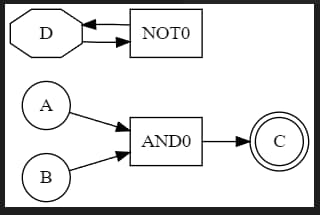
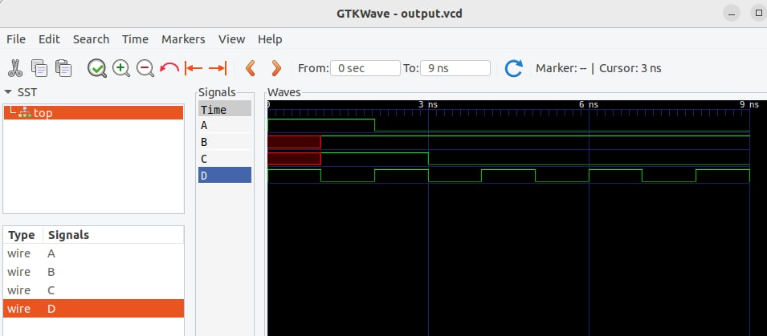

# Симулятор цифровых логических схем

На `golang` сделан MVP простого симулятор-интерпретатора в котором в функции `main` написан конструирующий схему код и условный `simulate` который выполняет симуляцию и завершается когда кончилось время симуляции либо схема пришла к неизменному состоянию.

## Элементы представления схемы

Схема состоит из проводов `wire` которые соединяют между собой логические элементы `gate`. На начальном шаге состояния уровней `wire` и `gate` в неопределенном состоянии X. Для удобства симуляции `wire` и `gate` хранят свое состояние. Состояние `wire` может быть изменено внешним воздействием, либо выходным состоянием `gate`. Состояние `gate` пересчитывается только если сменилось состояние хотя бы одного входного `wire`.

Цепочки из `wire` пока не поддерживаются.

## Процесс симуляции

Схему возбуждаем неким входным вектором, который формирует список `wire` состояния которых изменились.

На *i*-том шаге симуляции выбираем список проводов состояние которых изменилось на противоположное, по этому списку добавляем соответствующий `gate` в очередь обсчета `gate` на следующий шаг симуляции. Далее для всех `gate` считаем выходное состояние и если оно изменилось то добавляем соотв. `wire` на шаг *i+1*.

Задержка всех элементов принята за единицу шага итерации.

Каждый `wire` имеет список `gate` ко входам которых он подключен, каждый `gate` знает к какому `wire` подключен его выход и входы.

`wire` не имеющий подключенных `gate` ко его входу считается выходным, а не имеющий подключений ко входу - входным.

## Входные данные симулятора

Текст программы на языке `Go`

```go
A := newWire("A")
B := newWire("B")
C := newWire("C")

D := newWire("D")

G1 := newGate("AND0", AndFunc)

G2 := newGate("NOT0", NotFunc)

attach(G1, []int{A, B}, []int{C})
attach(G2, []int{D}, []int{D})
```

## Выходные данные

1. Дамп схемы и трассировка в stdout

    ```
    Wire table:
    id: 0 name: A state: X
    connected to: AND0
    id: 1 name: B state: X
    connected to: AND0
    id: 2 name: C state: X
    id: 3 name: D state: X
    connected to: NOT0

    Gate table:
    id: 0 name: AND0
    inputs: A B
    outputs: C
    id: 1 name: NOT0
    inputs: D
    outputs: D

    tick: 0 signal: A changed to: T
    tick: 0 signal: D changed to: T

    tick: 0 gate: AND0 touched by A
    tick: 0 gate: NOT0 touched by D

    tick: 0 gate: AND0 changed to: T
    tick: 0 signal: C changed to: T
    tick: 0 gate: NOT0 changed to: F
    tick: 0 signal: D changed to: F

    tick: 1 signal: B changed to: T

    tick: 1 gate: AND0 touched by B
    tick: 1 gate: NOT0 touched by D

    tick: 1 gate: NOT0 changed to: T
    tick: 1 signal: D changed to: T

    tick: 2 signal: A changed to: F

    tick: 2 gate: NOT0 touched by D
    tick: 2 gate: AND0 touched by A

    tick: 2 gate: NOT0 changed to: F
    tick: 2 signal: D changed to: F
    tick: 2 gate: AND0 changed to: F
    tick: 2 signal: C changed to: F

    tick: 3 gate: NOT0 touched by D

    tick: 3 gate: NOT0 changed to: T
    tick: 3 signal: D changed to: T

    tick: 4 gate: NOT0 touched by D

    tick: 4 gate: NOT0 changed to: F
    tick: 4 signal: D changed to: F
    ```

2. Вывод схемы в GraphViz

    

    Круги - входы, двойные круги - выходы, восьмиугольники - промежуточные провода.

    На данной схеме выход элемента НЕ подключен на вход и запускается единичным импульсом.

3. Вывод трассировки в формате VCD
    
    Можно посмотреть в GtkWave
    
    

## Недостатки

Захардкоженные параметры.

Использование пустых хеш-таблиц в качестве множеств (для передачи активированных логических элементов и соотв. проводов).

## Отдаленные планы

1. Попробовать сделать симуляцию на каналах `go`
2. Состряпать простой генератор из сконструированной схемы в код на `golang` который можно скомпилировать и запустить подобно `verilator`